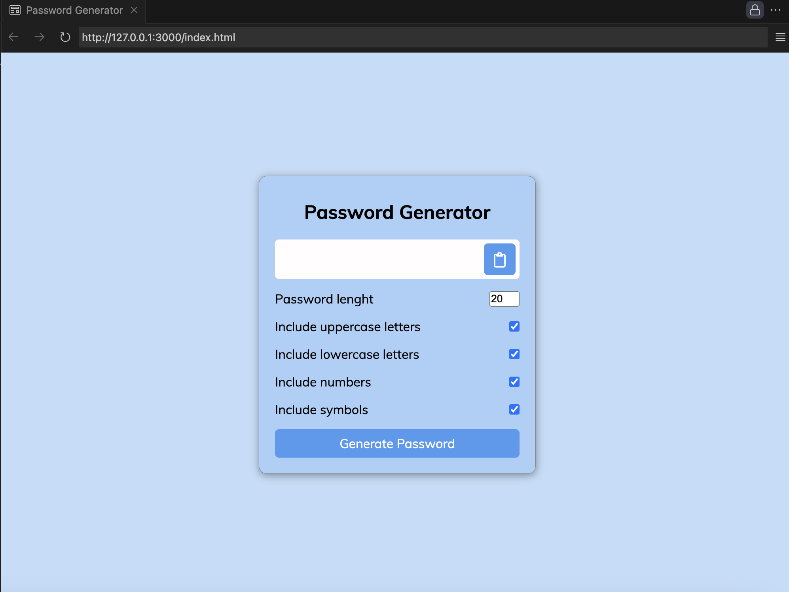

# Password-Generator 🔐



A customizable and user-friendly password generator built with JavaScript, HTML, and CSS. This tool allows users to generate strong, secure passwords with adjustable criteria such as length, uppercase/lowercase letters, numbers, and symbols. The generated password can be easily copied to the clipboard, making it an essential tool for enhancing online security.

## Key Features
- **Customizable Criteria**: Select the password length (4-20 characters) and include/exclude uppercase letters, lowercase letters, numbers, and symbols.
- **Secure Passwords**: Generates strong and random passwords to help protect your accounts.
- **Clipboard Functionality**: Quickly copy the generated password with a single click.
- **Responsive Design**: Fully responsive and works seamlessly on all screen sizes.
- **Interactive UI**: Sleek and intuitive interface with smooth transitions.

## Technologies Used
- **Frontend**: HTML, CSS (modern, responsive design).
- **JavaScript**: Handles password generation logic and clipboard functionality.

## How to Run
1. Clone the repository:
   ```bash
   git clone https://github.com/yourusername/password-generator.git
   cd password-generator
   ```
2. Open `index.html` in your browser to start using the password generator.

### Live Demo
Check out the live [demo](https://chrisroland.github.io/Password-Generator/)

## Contributions
- Feel free to **open issues** if you encounter any bugs or have suggestions for improvement.
- **Pull requests** are welcome for any feature additions or enhancements.
- This project is **open-sourced**, and I'm open to **constructive feedback** and **contributions**!

## Future Enhancements
- Add an option to exclude similar-looking characters (e.g., `1` and `l`, `0` and `O`).
- Implement a password strength meter.
- Save preferences for future use.
- Add a dark mode toggle.

Thank you for checking out this project! ❤️